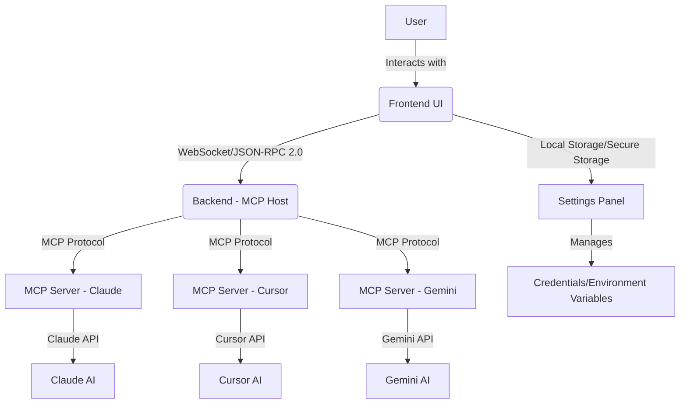

# Architectural Design for a Multi-AI Terminal Application

## Introduction

This document outlines the architectural design for a multi-AI terminal application, building upon the existing `slash_mcp` project and adhering to the Model Context Protocol (MCP) ethos. The primary goal is to enable side-by-side functional terminals that can interact with various AI code generation models, specifically Claude Code, Cursor, and Gemini Code, while providing a robust settings panel for environment and credential management.

## Core Principles

1.  **MCP-First Ethos**: All AI model integrations will leverage the Model Context Protocol to ensure a standardized and extensible communication layer.
2.  **Modularity**: The system will be designed with modular components to facilitate easy integration of new AI models and features.
3.  **Scalability**: The architecture should support future expansion to include more AI models and complex workflows.
4.  **User Experience**: Provide a seamless and intuitive user interface with side-by-side terminals and an accessible settings panel.
5.  **Security**: Emphasize secure handling of API keys and credentials.

## High-Level Architecture

The multi-AI terminal application will consist of the following main components:

1.  **Frontend (UI)**: A React-based web application providing the user interface, including the side-by-side terminals, input fields, output displays, and the settings panel.
2.  **Backend (MCP Host)**: A Node.js/WebSocket server (based on `slash_mcp`'s `server/index.js`) acting as the central MCP Host. This component will manage connections from the frontend and route requests to various MCP Servers.
3.  **MCP Servers (AI Integrations)**: Dedicated services or proxies that expose AI models (Claude, Cursor, Gemini) as MCP-compliant endpoints. These will translate MCP requests into AI-specific API calls and vice-versa.
4.  **Credential Management**: A secure mechanism within the settings panel to store and manage API keys and other environment variables for the AI models.

## Component Breakdown

### 1. Frontend (UI)

**Technology**: React 18 + Vite + Tailwind + Framer-Motion (leveraging `slash_mcp`'s existing stack).

**Key Features**:

- **Side-by-Side Terminals**: Two or more interactive terminal instances displayed concurrently. Each terminal should be configurable to connect to a specific AI model or the default shell.
- **Input/Output**: Real-time display of AI model responses, code suggestions, and command outputs.
- **Settings Panel**: A dedicated section for:
  - **AI Model Configuration**: Enabling/disabling AI models, configuring their respective MCP Server URLs.
  - **Credential Management**: Secure input and storage of API keys and other necessary credentials for each AI model. This could involve local storage (for client-side only) or secure backend storage (for server-side processing).
  - **Environment Variable Emulation**: A mechanism to set or emulate environment variables that the MCP Servers or AI integrations might require.
  - **MCP Connection Management**: Displaying connection status to various MCP Servers.
- **Resource Sidebar**: Existing `slash_mcp` feature for managing resources, which can be extended to include AI-specific tools or prompts.
- **Drag-and-Drop Functionality**: For prompts, resources, and potentially AI-generated code snippets.

### 2. Backend (MCP Host)

**Technology**: Node.js + `ws` (leveraging `slash_mcp`'s `server/index.js`).

**Key Responsibilities**:

- **WebSocket Server**: Handles incoming WebSocket connections from the frontend.
- **JSON-RPC 2.0 Handling**: Parses incoming JSON-RPC requests from the frontend and constructs responses.
- **MCP Routing**: Routes MCP requests (`mcp_invokeTool`, `mcp_sendResource`, `mcp_getCapabilities`) to the appropriate MCP Server based on configuration.
- **Tool Registry**: Auto-discovers and manages available tools exposed by connected MCP Servers.
- **Stdout Streaming**: Relays real-time output streams from MCP Servers back to the relevant frontend terminal.
- **Credential Forwarding (Optional)**: If credentials are managed server-side, securely forwards them to the MCP Servers.

### 3. MCP Servers (AI Integrations)

These will be separate services or processes that act as intermediaries between the MCP Host and the specific AI model APIs. Each AI model will ideally have its own MCP Server.

#### a. Claude Code MCP Server

**Technology**: Python (`mcp-proxy`) as demonstrated in `slash_mcp` README.

**Integration Details**:

- Utilize `mcp-proxy` in stateless Streamable-HTTP mode.
- The `mcp-proxy` will wrap the `claude mcp serve` command.
- The MCP Server will expose tools (e.g., `Bash`, `Python`) that can be invoked by the MCP Host.
- API key (`ANTHROPIC_API_KEY`) will be provided to the `mcp-proxy` process.

#### b. Cursor MCP Server

**Technology**: To be determined, likely Python or Node.js, depending on Cursor's API and SDK availability.

**Integration Details**:

- This MCP Server will need to expose Cursor's code generation and editing capabilities as MCP tools.
- It will translate MCP `mcp_invokeTool` requests into Cursor API calls.
- Credential management for Cursor's API will be handled here.

#### c. Gemini Code MCP Server

**Technology**: To be determined, likely Python or Node.js, depending on Gemini's API and SDK availability.

**Integration Details**:

- Similar to the Cursor integration, this MCP Server will expose Gemini's code generation capabilities as MCP tools.
- It will translate MCP `mcp_invokeTool` requests into Gemini API calls.
- Credential management for Gemini's API will be handled here.

### 4. Credential Management

**Mechanism**: The `slash_mcp` project already uses environment variables for API keys (`CLAUDE_MCP_URL`, `ANTHROPIC_API_KEY`). For a user-friendly settings panel, these could be managed in a few ways:

- **Client-Side (LocalStorage)**: For development or single-user setups, API keys can be stored securely in the browser's local storage. This simplifies backend complexity but requires careful handling to prevent exposure.
- **Backend-Side (Secure Storage)**: For multi-user or more robust deployments, API keys could be stored encrypted in a backend database (e.g., Supabase, as `slash_mcp` mentions). The backend would then inject these credentials into the environment of the respective MCP Servers.
- **Environment Variable Emulation**: The settings panel could allow users to input key-value pairs that are then used to set environment variables for the MCP Servers when they are launched or connected.

## Interaction Flow

1.  **User Action**: User types a command or prompt into a terminal in the Frontend UI.
2.  **Frontend to Backend**: The Frontend sends a JSON-RPC request (e.g., `mcp_invokeTool`) to the Backend (MCP Host) via WebSocket.
3.  **Backend to MCP Server**: The MCP Host identifies the target AI model based on the request (e.g., `tool claude_mcp_invoke`) and forwards the MCP request to the corresponding MCP Server.
4.  **MCP Server to AI API**: The MCP Server translates the MCP request into a specific API call for Claude, Cursor, or Gemini.
5.  **AI API Response**: The AI model processes the request and returns a response to its MCP Server.
6.  **MCP Server to Backend**: The MCP Server translates the AI response back into an MCP-compliant format and streams it back to the MCP Host.
7.  **Backend to Frontend**: The MCP Host relays the response to the Frontend UI, which displays it in the appropriate terminal.

## Future Considerations

- **Containerization**: Use Docker and `docker-compose` for easy deployment and isolation of the Backend and MCP Servers, as suggested in the `slash_mcp` roadmap.
- **Authentication/Authorization**: Implement robust authentication for the frontend and authorization for accessing AI models, especially for multi-user scenarios.
- **Persistent Storage**: Integrate with Supabase or similar for persistent storage of user settings, prompts, and potentially AI-generated content.
- **Tool Discovery**: Enhance the tool discovery mechanism to dynamically update the frontend with available tools from all connected AI models.

This architectural design provides a clear roadmap for extending the `slash_mcp` project into a powerful multi-AI terminal application, leveraging the flexibility and standardization offered by the Model Context Protocol.

## Implementation Roadmap and Recommendations

This section provides a phased roadmap for implementing the multi-AI terminal application, along with key recommendations for each stage.

### Phase 1: Foundational Setup and Claude Integration (Estimated: 2-4 weeks)

**Goal**: Establish the core multi-terminal UI and successfully integrate Claude Code as an MCP Server.

**Tasks**:

1.  **Frontend Terminal Enhancement**:
    - Modify the existing `slash_mcp` frontend to support rendering multiple, independently controllable terminal instances side-by-side.
    - Implement basic UI controls for adding/removing terminals and switching their associated AI backend.
    - Ensure proper resizing and layout management for the terminals.
2.  **Settings Panel MVP**:
    - Create a basic settings panel UI within the frontend.
    - Implement functionality to input and store `CLAUDE_MCP_URL` and `ANTHROPIC_API_KEY` in browser's `localStorage` for initial testing.
    - Add a connection status indicator for the Claude MCP Server.
3.  **Claude MCP Server Integration**:
    - Set up the `mcp-proxy` and Claude CLI as described in the `slash_mcp` README.md. Automate this setup using a shell script or Dockerfile if possible.
    - Verify that the `slash_mcp` backend can successfully connect to and invoke tools on the Claude MCP Server.
    - Test basic `claude_mcp_invoke` commands from the frontend through the `slash_mcp` backend to the Claude MCP Server.

**Recommendations**:

- **Prioritize Claude**: Focus solely on Claude integration in this phase, as its setup is already documented in the `slash_mcp` repository.
- **Iterative UI Development**: Start with minimal UI for multi-terminal functionality and progressively enhance it.
- **Dockerize `mcp-proxy`**: Create a Docker image for the `mcp-proxy` and Claude CLI to simplify deployment and ensure consistent environments.

### Phase 2: Cursor and Gemini Integration (Estimated: 4-6 weeks)

**Goal**: Integrate Cursor and Gemini Code as MCP Servers, making them accessible from the multi-terminal UI.

**Tasks**:

1.  **Cursor MCP Server Development**:
    - Research Cursor's API and SDKs. Identify the best approach to create an MCP-compliant server for Cursor.
    - Develop a new service (e.g., in Python or Node.js) that acts as an MCP Server for Cursor. This service will translate MCP requests into Cursor API calls and stream responses back.
    - Implement secure handling of Cursor API keys.
2.  **Gemini Code MCP Server Development**:
    - Research Gemini's API and SDKs. Identify the best approach to create an MCP-compliant server for Gemini.
    - Develop a new service (e.g., in Python or Node.js) that acts as an MCP Server for Gemini. This service will translate MCP requests into Gemini API calls and stream responses back.
    - Implement secure handling of Gemini API keys.
3.  **Frontend Integration for New AIs**:
    - Extend the settings panel to allow configuration of Cursor and Gemini MCP Server URLs and API keys.
    - Update the terminal UI to allow users to select Cursor or Gemini as the active AI backend for a given terminal.
    - Implement dynamic tool discovery for Cursor and Gemini tools in the frontend.

**Recommendations**:

- **API Research First**: Thoroughly investigate Cursor and Gemini APIs before starting development to understand their capabilities and limitations.
- **Modular MCP Servers**: Ensure each AI's MCP Server is a standalone, deployable unit.
- **Error Handling**: Implement robust error handling and logging within each MCP Server to diagnose integration issues.

### Phase 3: Advanced Features and Refinement (Estimated: 3-5 weeks)

**Goal**: Enhance the application with advanced features, improve user experience, and prepare for robust deployment.

**Tasks**:

1.  **Enhanced Credential Management**:
    - Migrate API key storage from `localStorage` to a more secure backend solution (e.g., Supabase integration as suggested in `slash_mcp` roadmap, or a dedicated secrets management service).
    - Implement environment variable emulation within the settings panel, allowing users to define custom environment variables that are passed to the MCP Servers.
2.  **Real-time Output Streaming**:
    - Ensure that all AI responses and command outputs are streamed in real-time to the frontend terminals, leveraging MCP's `mcp_streamOutput`.
3.  **Docker-Compose Deployment**:
    - Create a `docker-compose.yml` file to orchestrate the deployment of the `slash_mcp` backend, Claude MCP Server, Cursor MCP Server, and Gemini MCP Server.
    - Document the `docker-compose` setup for easy local development and deployment.
4.  **User Experience Improvements**:
    - Refine the UI/UX of the terminals and settings panel based on user feedback.
    - Implement features like command history, autocomplete, and syntax highlighting for AI-generated code.
5.  **Testing and Quality Assurance**:
    - Develop comprehensive unit and integration tests for all components.
    - Perform end-to-end testing of the multi-AI terminal application.

**Recommendations**:

- **Security Audit**: Conduct a security review of credential management and data flow.
- **Performance Optimization**: Profile and optimize the application for responsiveness, especially with real-time streaming.
- **Documentation**: Create detailed user and developer documentation for the entire application.

### Overall Recommendations

- **Leverage Existing `slash_mcp`**: Maximize the use of the existing `slash_mcp` codebase for the frontend and core backend functionalities.
- **Open Source Contribution**: Consider contributing generic MCP Server implementations for popular AI models back to the MCP community.
- **Community Engagement**: Engage with the MCP community and AI model communities for best practices and support.
- **Version Control**: Maintain strict version control and use branching strategies for feature development.
- **Continuous Integration/Continuous Deployment (CI/CD)**: Set up CI/CD pipelines to automate testing and deployment processes.
